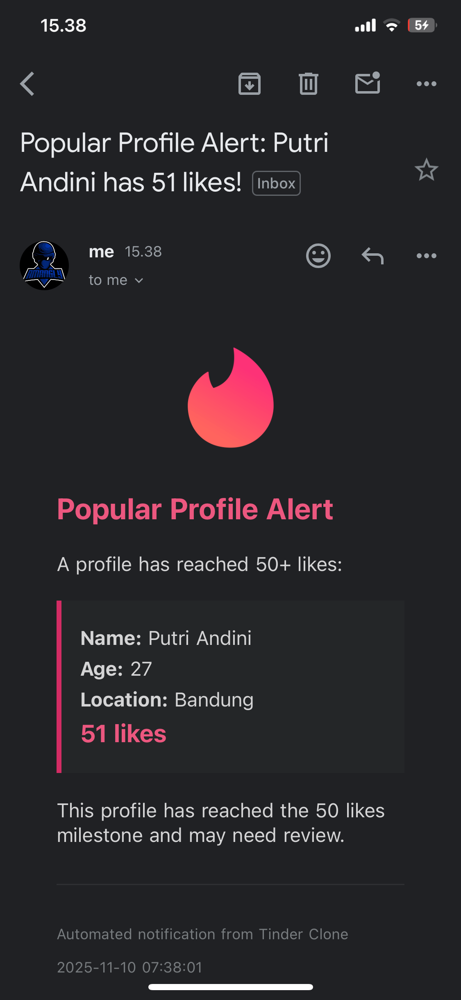

# Tinder Clone - PHP Laravel + React Native

Dating app with swipe functionality built with Laravel backend and React Native mobile app.

## Stack

**Backend:** Laravel 12, PHP 8.2+, MySQL 8.0, Laravel Sanctum, Swagger

**Mobile:** React Native (Expo), React Query, Atomic Design, TypeScript

## Architecture Decisions

### State Management: React Query Only (No Recoil)

The PRD recommended "React Query + Recoil", but this app uses **React Query only**. Here's why:

- **React Query** handles all server state (API calls, caching, mutations)
- **Component useState** handles local UI state (card index, swipe tracking)
- **No global UI state needed** - no shared theme, filters, or complex derived state

**YAGNI Principle:** Recoil would add unnecessary complexity for this scope. React Query alone provides everything needed for data fetching, caching, and optimistic updates.

## Features (PRD Implementation)

### Backend
**People Data:** name, age, pictures, location

**API Endpoints:**
1. `GET /api/recommendations` - Paginated list of recommended people
2. `POST /api/likes` - Like a person
3. `POST /api/dislikes` - Dislike a person
4. `GET /api/liked-people` - List of liked people
5. **Cronjob** - Email admin when profile reaches 50+ likes (daily 9 AM)

### Mobile App
1. Splash screen
2. Opponent card (Tinder-style swipe)
3. Authentication & profile setup
4. Liked opponent list

## Quick Start

### Backend Setup
```bash
cd backend
composer install
cp .env.example .env
php artisan key:generate

# Configure database in .env
php artisan migrate
php artisan storage:link

# Start server
php artisan serve
```

### Mobile Setup
```bash
cd mobile-app
npm install
npx expo start
```

## Database Schema

- `users` - Authentication (id, name, email, password)
- `people` - Profiles (id, user_id, name, age, location)
- `pictures` - Photos (id, person_id, image_url, order)
- `likes` - (id, liker_id, liked_id)
- `dislikes` - (id, disliker_id, disliked_id)

## API Documentation

**Swagger:** https://amangly.duckdns.org/api/documentation

## Deployment

**VPS:** Nginx + PHP-FPM 8.2
**Domain:** https://amangly.duckdns.org

### Crontab
```bash
* * * * * cd /home/amangly/tinder-clone/backend && php artisan schedule:run >> /dev/null 2>&1
```

### Queue Worker
```bash
php artisan queue:work --daemon
```

## Testing

### Email Notifications
```bash
cd backend
php artisan profiles:check-popular --threshold=10
php artisan queue:work --once
```

Default threshold: **50 likes** (PRD requirement)

### Email Notification Example

When a profile reaches the threshold, the admin receives an email notification:



## Demo Accounts

The database includes 10 test accounts with profiles and pictures for testing:

```
Email               | Name                  | Password
------------------- | --------------------- | ------------
siti@test.com      | Siti Nurhaliza        | password123
putri@test.com     | Putri Andini          | password123
dewi@test.com      | Dewi Lestari          | password123
raisa@test.com     | Raisa Andriana        | password123
isyana@test.com    | Isyana Sarasvati      | password123
titi@test.com      | Titi Kamal            | password123
bcl@test.com       | Bunga Citra Lestari   | password123
maudy@test.com     | Maudy Ayunda          | password123
chelsea@test.com   | Chelsea Islan         | password123
dian@test.com      | Dian Sastro           | password123
```

All accounts have complete profiles with photos ready for swipe functionality testing.

## License

MIT
